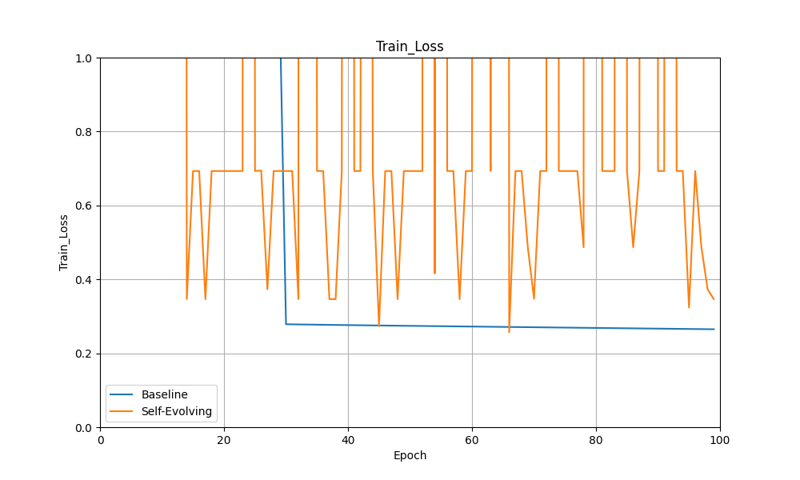
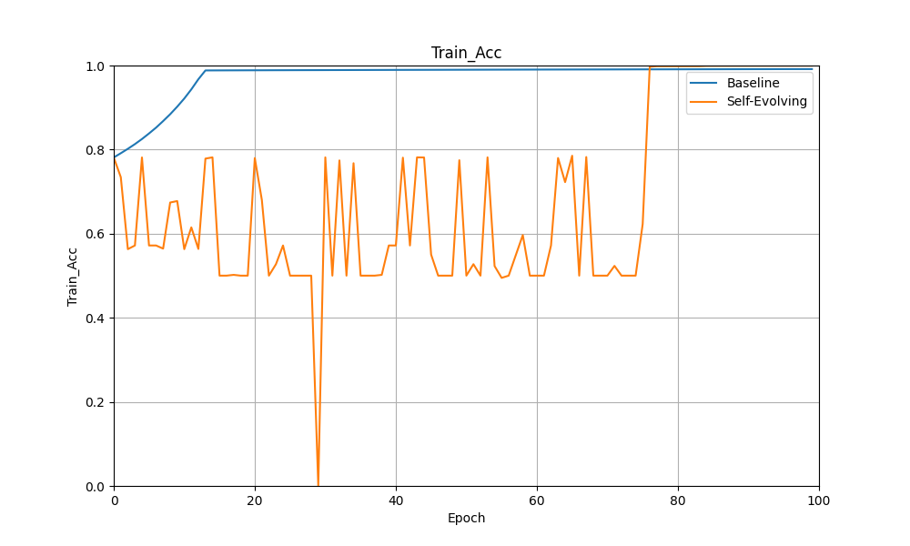
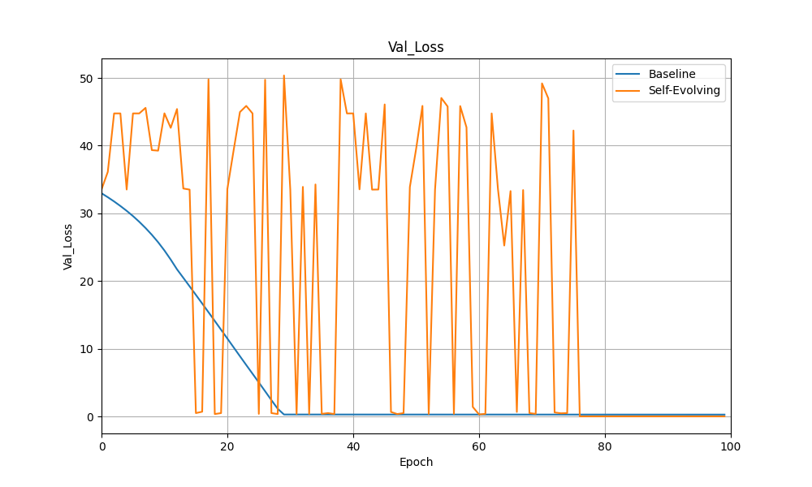
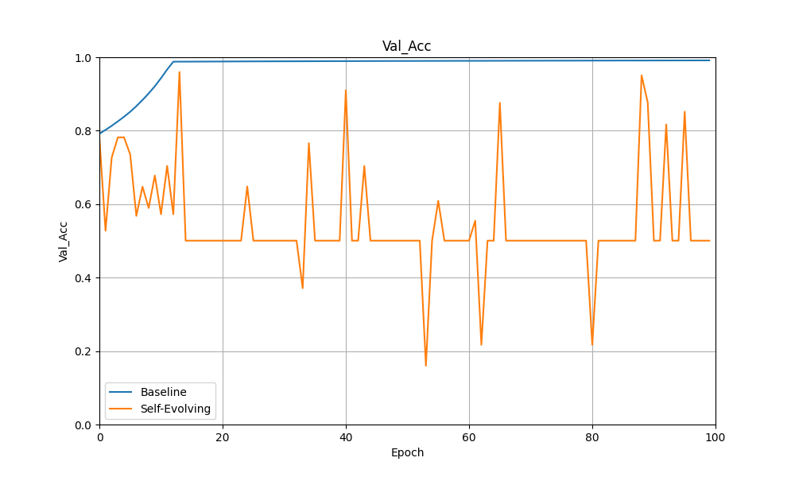

# Self-Evolging-model-w/o-backprop

| Train Loss  |Train Acc |
|:-------------------------:|:--------------------------:|
| Valid Loss |Valid Acc   |

# Quick start
Add your OPENAI_ORGANIZATION and OPENAI_API_KEY into .env
```
python3 -m venv work
```
```
source work/bin/activate
```
```
pip3 install -r requirements.txt
```
```
python3 selfevolve.py
```